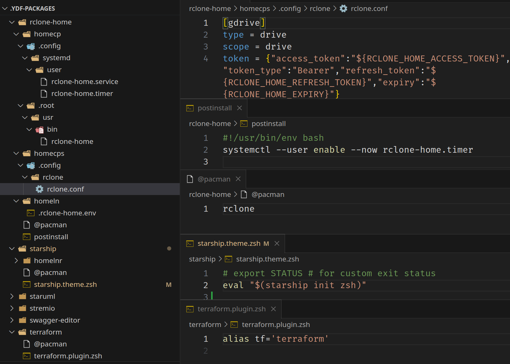

# .ydf-packages



**_A working environment declared in a simple directory structure_**

## About

My YDF Packages Directory

## Requirements

You need a `ydf packages` `interpreter`, you can get it from:
<https://github.com/yunielrc/ydf>

## Install

Clone the repository

```sh
cd && git clone https://github.com/yunielrc/.ydf-packages
```

## Configure

Cd to the repository

```sh
cd ~/.ydf-packages
```

Open the repository in your preferred code editor

```sh
code .
```

Copy the `envsubst.env` from the sample and edit it if you need

```sh
cp envsubst.env.sample envsubst.env
```

Modify the the `packages` to fit your needs

Create your `packages selection` files

```sh
touch manjaro-work-pc.pkgs
touch ubuntu-gaming-pc.pkgs
```

Add packages to your `packages selection` files, one per line,
you can add comments using `#` at the beginning of the line.

Save the `packages directory` on your own git repository

## Usage

Install one package

```sh
ydf package install <package-name>
```

Install all packages from a `packages selection` file

```sh
ydf package install <selection>.pkgs
```
